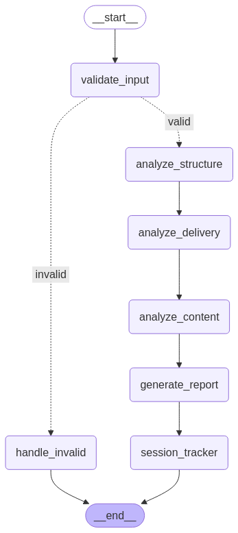
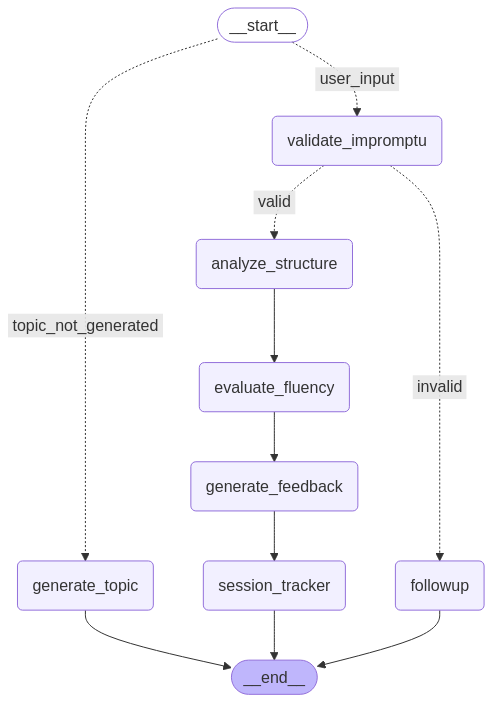
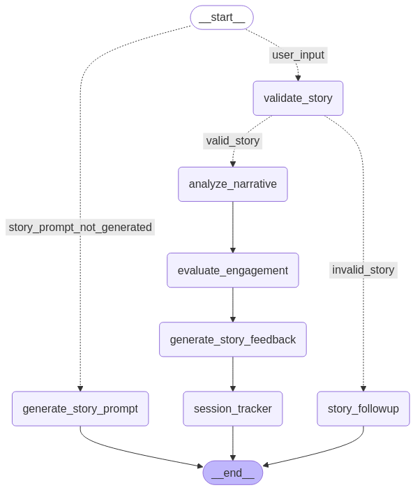
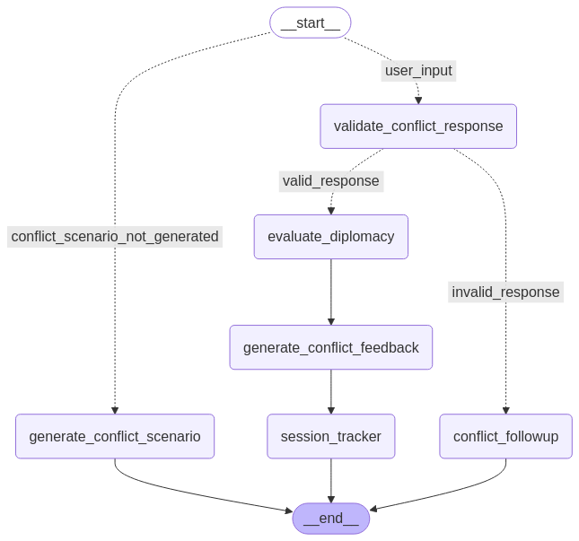

# Agentic Verbal Communication Skills Trainer

---

## Overview
The **Agentic Verbal Communication Skills Trainer** is a demo application designed to help users improve their verbal communication skills through AI-powered assessment and training. Built with open-source language models (LLMs), this tool provides structured feedback and actionable tips for enhancing presentation and speaking skills.

---

## Features
The application is divided into two main components:

### 1. Presentation Assessment
  
This module evaluates presentation transcripts and provides detailed feedback. Key functionalities include:
- **Transcript Validation**: Ensures the input meets required criteria.
- **Evaluation**: Assesses structure, content, and delivery.
- **Feedback Generation**: Provides actionable improvement tips.

### 2. Skills Training
This module includes three specialized training programs:

#### a. Impromptu Speaking
  
- **Topic Generation**: Creates impromptu speaking topics based on user-selected categories.
- **Transcript Evaluation**: Assesses fluency, structure, and coherence.
- **Feedback**: Offers tailored suggestions for improvement.

#### b. Storytelling
  
- **Topic Generation**: Generates storytelling prompts based on user preferences.
- **Transcript Evaluation**: Analyzes narrative structure, content, and engagement.
- **Feedback**: Provides insights to enhance storytelling skills.

#### c. Conflict Resolution
  
- **Topic Generation**: Creates conflict resolution scenarios for practice.
- **Transcript Evaluation**: Evaluates structure, content, and resolution strategies.
- **Feedback**: Delivers actionable tips for improving conflict resolution skills.

---

## Technical Highlights
- **Multi-Agent System**: Enables efficient use of smaller open-source LLMs like `llama-3.2-3b`.
- **Groq API Integration**: Accelerates performance for quick and smooth testing.
- **Modular Design**: Easy to extend and customize for additional training modules.

---

## Getting Started

### Prerequisites
- Python 3.9+
- pip package manager
- (Optional) Groq API key for enhanced performance

### Installation
1. Clone the repository:
   ```bash
   git clone https://github.com/your-org/Agentic-Verbal-Communication-Skills-Trainer.git
   ```
2. Install dependencies:
   ```bash
   make setup
   ```

### Configuration
You can use the llm from Groq API for faster performance or from huggingface for local hosting of the llm:
1. Set the following in `config.yaml`:
   ```yaml
   llm_use: "grop" or "huggingface"
   ```
2. Obtain a free HugginFace token from HuggingFace.
4. Add the HF_TOKEN to your environment:
   ```bash
   export HF_TOKEN=your_api_key_here
   ```
5. Obtain a free API key from [Groq](https://console.groq.com/keys).
6. Add the API key to your environment:
   ```bash
   export GROQ_API_KEY=your_api_key_here
   ```
---

## Usage
To run the Streamlit-based application:
```bash
make run_app
```

---

## Notes
- The multi-agent architecture allows the system to efficiently use smaller open-source LLMs. (each agent is focused on a specific smaller task)
- Groq API integration is recommended for faster and smoother testing.
- The application is designed to be modular, making it easy to add new training modules or evaluation criteria.

---